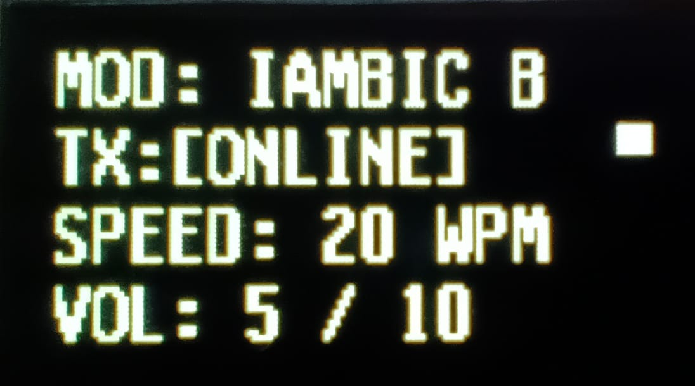
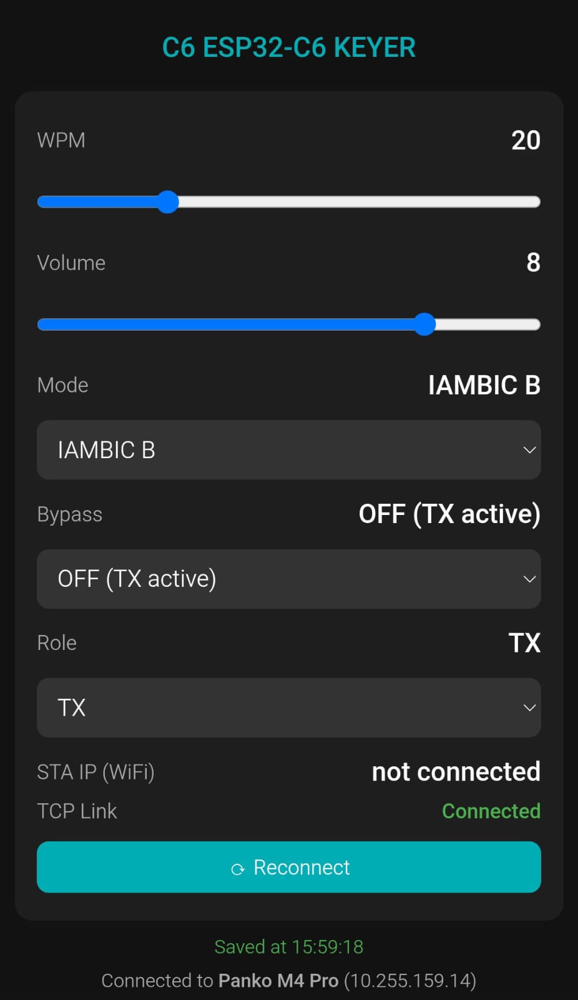
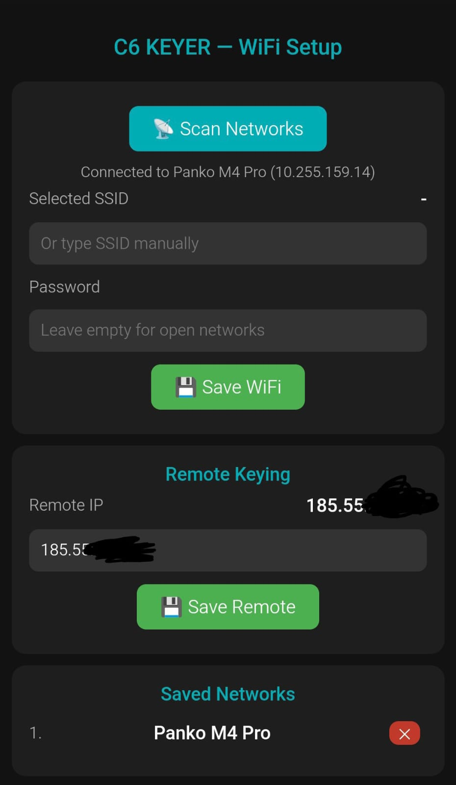

# ESP32-C6 Remote Keyer

> Remote CW keyer over Internet using ESP32-C6 and raw TCP transport.


Operate your CW station remotely while preserving your exact keying style, timing and fist.

The system consists of two ESP32-C6 devices:

- **TX Unit** connected to a paddle, bug or straight key
- **RX Unit** connected to the radio key input

The transmitter sends keying events over the Internet using a lightweight TCP protocol. The receiver reproduces them in real time on the radio, preserving the original rhythm and characteristics of the operator.

No Morse decoding. No character transmission. No CW regeneration.

Just your keying — remotely.

---

## 📡 Features

✅ Remote CW over TCP/IP

✅ Straight Key, Iambic A, Iambic B and Bug modes

✅ Preserves original operator timing ("fist")

✅ Adjustable latency buffer (0–1000 ms)

✅ OLED SSD1306 support

✅ Built-in Web UI

✅ WiFi 6 capable ESP32-C6 platform

✅ TX / RX / Standalone operating modes

✅ Configuration stored in NVS

✅ Smartphone hotspot compatible

✅ Local sidetone for perfect operator feedback

✅ TCP keepalive and automatic reconnection

---

## 🏗 Architecture


### TX Unit

- Reads paddle/key inputs
- Generates local sidetone
- Sends timing information via TCP
- Can operate through smartphone hotspot

### RX Unit

- TCP server on port **7373**
- Generates radio keying output
- Independent HTTP configuration server
- Fixed IP mandatory (at the moment)

---

## 📸 Screenshots

### OLED Display

<table>
  <tr>
    <td align="center"><a href="assets-screenshots/Oled.jpeg"></a><br><em>Oled</em></td>
  </tr>
</table>


### Web UI

<table>
  <tr>
    <td align="center"><a href="assets-screenshots/Home.jpeg"></a><br><em>Home</em></td>
    <td align="center"><a href="assets-screenshots/Network.jpeg"></a><br><em>Network</em></td>
  </tr>
</table>


---

## ⚡ Quick Start

| Step | Action |
|--------|----------|
| 1 | Flash firmware on both ESP32-C6 boards |
| 2 | Connect each unit to WiFi |
| 3 | Configure one device as RX |
| 4 | Configure router port forwarding |
| 5 | Configure second device as TX |
| 6 | Start sending CW |

---

# 🔧 Hardware Requirements

- 2 × ESP32-C6 DevKitC-1
- Paddle, bug or straight key
- Radio transceiver with key input
- SSD1306 OLED display (optional)
- USB power supply or battery pack
- Internet connection
- Router with public IP address (RX side)
- Smartphone hotspot or other WiFi with port 7373 open and no captive portal (TX side)

---

# 📍 Pinout

| GPIO | Function | Notes |
|--------|----------|----------|
| GPIO 2 | Paddle DOT | Internal pull-up |
| GPIO 3 | Paddle DASH | Internal pull-up |
| GPIO 4 | WPM UP | Internal pull-up |
| GPIO 5 | WPM DOWN | Internal pull-up |
| GPIO 6 | MODE | Internal pull-up |
| GPIO 7 | RADIO OUTPUT | Via optocoupler/transistor, to radio Key input |
| GPIO 10 | BYPASS | Internal pull-up |
| GPIO 15 | BUZZER | PWM output |
| GPIO 18 | I²C SDA | OLED display |
| GPIO 19 | I²C SCL | OLED display |

The OLED display is optional. The device operates normally without it.

---

# 🌐 Initial Configuration

## 1. Flash Firmware

```bash
# RX

pio run -t upload --upload-port COM8 (i.e.)

# TX

pio run -t upload --upload-port COM9 (i.e.)
```

For a brand-new ESP32-C6, hold BOOT while connecting the USB cable if necessary.

---

## 2. Connect to WiFi

At first boot the device creates:

```text
SSID: C6_KEYER
IP:   192.168.4.1
```

Open:

```text
http://192.168.4.1
```

Navigate to:

```text
WiFi Network Settings
```

Then:

1. Scan Networks
2. Select WiFi
3. Enter password
4. Save Configuration

The device reboots and joins your WiFi network.

---

## 3. Configure RX

Set:

```text
Role = RX
```

Assign a DHCP reservation or static lease on the router.

Example:

```text
192.168.1.50
```

---

## 4. Configure Port Forwarding

Forward TCP port:

```text
7373 → RX_IP:7373
```

Example:

```text
7373 → 192.168.1.50:7373
```

---

## 5. Configure TX

Set:

```text
Role = TX
Remote IP = Public IP of RX router
```

Save and reboot.

The TX automatically connects to the RX.

---

# 🎛 Operating Modes

| Mode | Description |
|--------|----------|
| Straight | Traditional straight key |
| Iambic A | Squeeze keying supported |
| Iambic B | Iambic A with 1-bit memory |
| Bug | Automatic dots, manual dashes |

---

# 🔘 Buttons

| Button | Short Press | Long Press |
|----------|------------|-------------|
| MODE | Cycle keyer mode | — |
| BYPASS | Toggle practice mode | Save settings |
| WPM + | Increase speed | — |
| WPM − | Decrease speed | — |

### Volume Adjustment

Press:

```text
MODE + WPM+
MODE + WPM-
```

to change sidetone volume.

---

# 💻 Web Interface

Every device provides a web interface.

| URL | Purpose |
|--------|----------|
| / | Main controls |
| /wifi | WiFi and network settings |
| /status | JSON diagnostics |

Examples:

```text
http://192.168.1.50
```

or

```text
http://192.168.4.1
```

when connected through AP mode.

---

# ⚙ How It Works

The TX unit captures paddle events and immediately sends key-down/key-up timing information to the RX unit over a raw TCP connection.

The receiver reproduces those events directly on the radio key input.

Unlike CW-over-text solutions, this system:

- Does not decode Morse characters
- Does not regenerate Morse timing
- Does not alter spacing
- Does not modify weighting

Therefore the transmitted CW retains the exact style ("fist") of the operator.

---

# 🔍 Diagnostics

Serial Monitor:

```bash
pio device monitor -b 115200
```

Common messages:

```text
TCP connected
TCP reconnecting
WiFi STA disconnected
TCP server listening on port 7373
Client connected
```

---

# 🛠 Troubleshooting

## TX does not connect

- Verify port forwarding
- Verify public IP address
- Check firewall rules
- Confirm mobile provider allows outgoing TCP connections

---

## Display not working

- Verify I²C wiring
- Verify pull-up resistors
- Check SSD1306 compatibility

---

## CW stops unexpectedly

- Check TCP connectivity
- Verify Internet stability
- Observe connection indicator on OLED

---

## No audio from buzzer

- Volume may be zero
- Check speaker wiring

---

# 📊 Technical Specifications

| Parameter | Value |
|----------|---------|
| MCU | ESP32-C6 (RISC-V) |
| CPU | 160 MHz |
| WiFi | 2.4 GHz 802.11 b/g/n/ax |
| Display | SSD1306 OLED |
| WPM Range | 5–70 |
| Latency Buffer | 0–1000 ms |
| Web Server | Port 80 |
| CW TCP Port | 7373 |
| Supply Voltage | 5 V USB or 5V via 15 and 16 pin (i.e. BMS + Li-Ion battery)|
| Consumption | ~200 mA |

---

# 🔨 Build From Source

```bash
git clone https://github.com/Panko74/ESP32-Remote-CW-Keyer.git

cd ESP32RemoteKeyer

pio run

pio run -t upload
```

---

# 🗺 Roadmap

- [X] Wiring schematic
- [ ] OTA firmware updates
- [ ] Dynamic DNS support
- [ ] TLS encrypted transport
- [ ] IPv6 support
- [ ] Battery-powered portable enclosure
- [ ] Embedded battery charging system

---

# 🤝 Contributing

Pull requests, bug reports and enhancement suggestions are welcome.

---

# 📜 License

Released under the MIT License.

73 de IW5DUA
